# School Management System (SMS) - Mermaid Diagrams

This document contains Mermaid code representing the structure, architecture, and workflows of the School Management System (SMS) as defined in the SRS.

## 1. System Architecture
This flowchart illustrates the multi-tier architecture of the SMS, including the frontend, backend API, database, and external integrations.

```mermaid
graph TD
    subgraph Client_Layer [Client Layer]
        A[Student / Parent Portal]
        B[Teacher Portal]
        C[Administrator Dashboard]
    end

    subgraph Frontend [Presentation Layer]
        D[Responsive Web UI]
        E[Session & State Manager]
    end

    subgraph Backend [Application Layer]
        F[API Gateway / REST API]
        G[Auth Service (OAuth2/JWT)]
        H[Attendance Service]
        I[Assessment Service]
        J[Scheduling Service]
        K[Notification Service]
        L[Reporting & Analytics]
    end

    subgraph Data_Layer [Data Layer]
        M[(Relational Database)]
        N[(Audit & Log Store)]
    end

    subgraph External_Integrations [External Integrations]
        O[Email / SMS Provider]
        P[Payment / Billing Gateway]
        Q[Biometric / RFID Devices]
        R[Identity Provider]
    end

    A --> D
    B --> D
    C --> D
    D --> F
    F --> G
    F --> H
    F --> I
    F --> J
    F --> K
    F --> L
    H --> M
    I --> M
    J --> M
    L --> M
    F --> N
    K --> O
    G --> R
    H --> Q
    K --> P
```

## 2. Entity Relationship Diagram (ERD)
This diagram defines the data structure and relationships between core entities like Students, Guardians, Courses, Authentication, and Participation records.

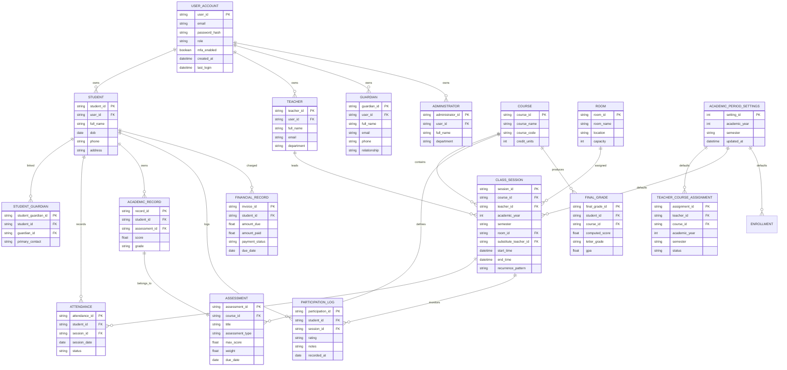

## 3. Use Case Diagram
This use case diagram represents the main activities performed by Administrators, Teachers, Students, and Parents.

```mermaid
usecaseDiagram
    actor Administrator
    actor Teacher
    actor Student
    actor Parent

    Administrator --> (Manage Users)
    Administrator --> (Configure System)
    Administrator --> (Schedule Classes)
    Administrator --> (Generate Reports)
    Administrator --> (Review Audits)

    Teacher --> (Mark Attendance)
    Teacher --> (Create Assessments)
    Teacher --> (Grade Student Work)
    Teacher --> (Manage Class Sessions)
    Teacher --> (Record Participation)
    Teacher --> (Send Announcements)

    Student --> (View Schedule)
    Student --> (Check Grades)
    Student --> (Submit Assignments)
    Student --> (Track Attendance)
    Student --> (Receive Notifications)

    Parent --> (Monitor Progress)
    Parent --> (View Attendance)
    Parent --> (Pay Fees)
    Parent --> (Receive Alerts)

    (Mark Attendance) ..> (Send Announcements)
    (Create Assessments) ..> (Grade Student Work)
    (View Schedule) ..> (Track Attendance)
    (Monitor Progress) ..> (Receive Alerts)
```

## 4. Data Flow Diagram - Context Level
This top-level DFD shows the system boundaries and external entities that interact with SMS.

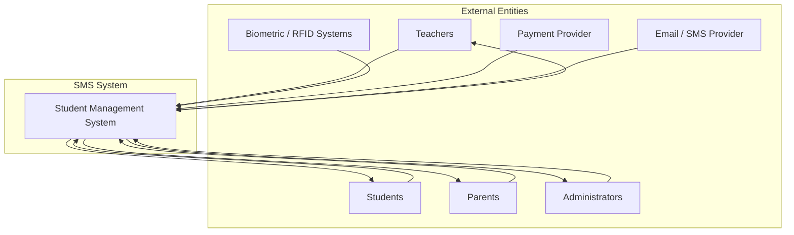

## 5. Data Flow Diagram - Level 1
This decomposed DFD breaks the core system into processes, data stores, and data flows.

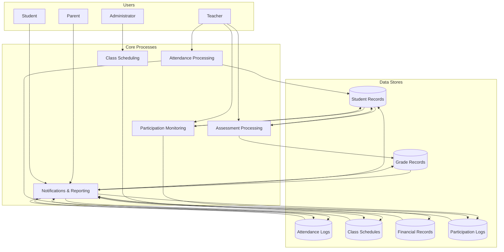

## 6. Sequence Diagram
This sequence diagram illustrates a teacher recording attendance, persisting the data, and notifying parents when a student is absent.

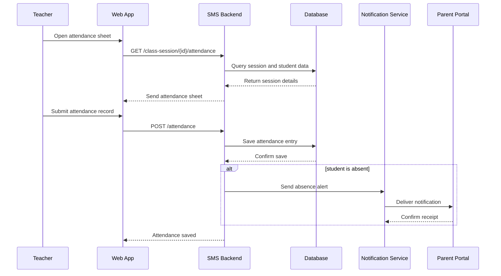

## 7. Sequence Diagram - Assessment and Final Grade Workflow
This sequence diagram shows how assessments are created, scored, and aggregated into a final course grade.

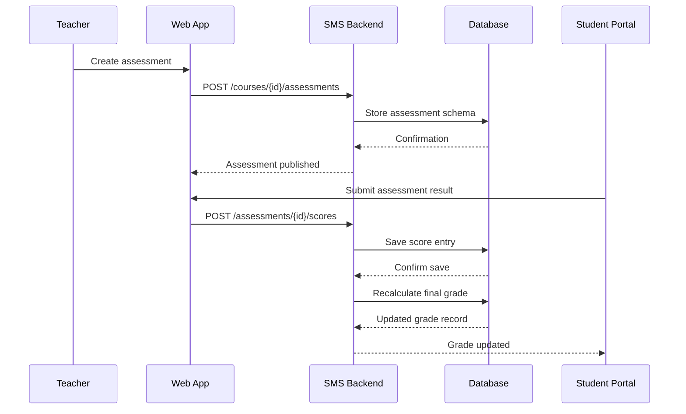

## 8. Sequence Diagram - Class Session Scheduling and Conflict Detection
This sequence diagram represents how class session requests are validated and scheduled.

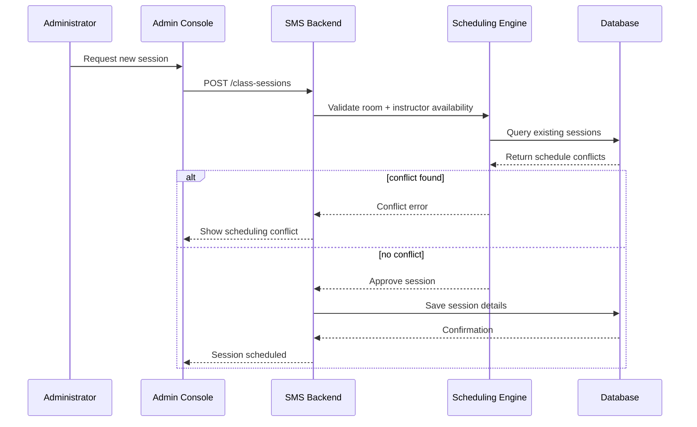

## 9. Sequence Diagram - Participation Logging and Reporting
This sequence diagram shows teachers logging participation and the system storing it for reporting.

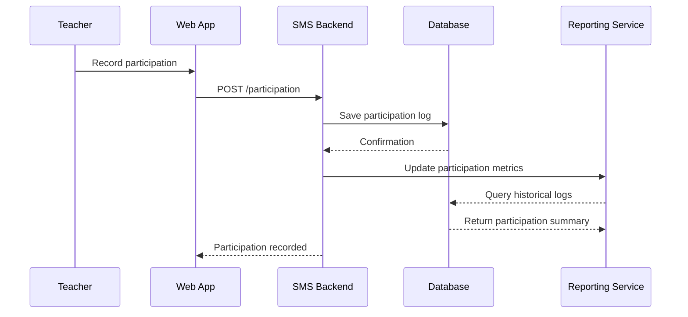

## 10. Component Diagram - Service Architecture
This diagram defines the core service boundaries and runtime components that support the SMS.

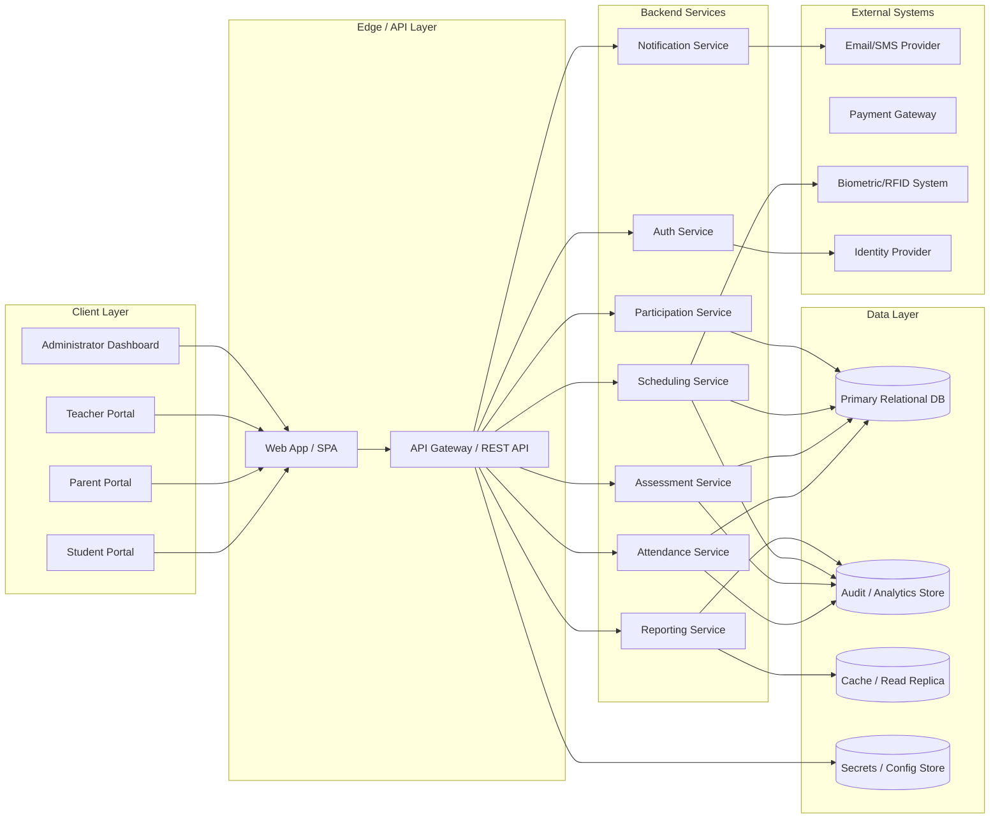

## 11. Sequence Diagram - Authentication and Authorization
This sequence diagram illustrates login, MFA, JWT issuance, and role validation in the SMS.

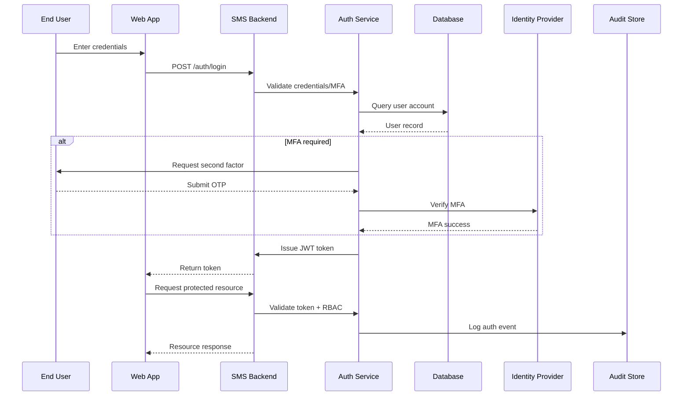

## 12. Sequence Diagram - Notification and Audit Logging
This sequence diagram shows absence notification delivery and audit tracking.

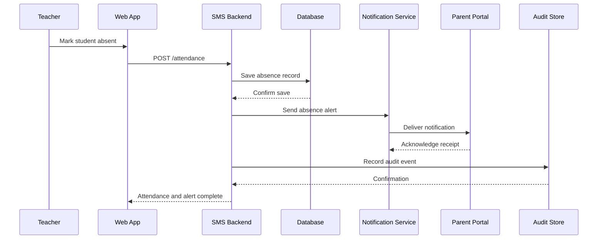

## 13. Deployment Architecture Diagram
This diagram shows the production deployment topology with containers, managed data services, and external integrations.

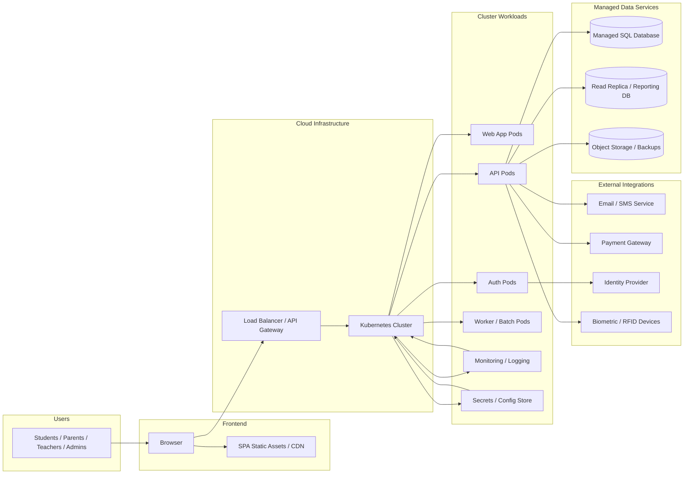

## 14. Existing Diagrams & System Overview
This file can be expanded with additional workflow diagrams, Gantt charts, or process maps as the SMS design evolves.

## 15. Technology Guidance Matrix
This section maps the current diagrams and requirements to the architectural choices you should evaluate before selecting a tech stack.

### 15.1 Frontend / Client
- Requirements: responsive portals for Students, Parents, Teachers, Administrators; secure JWT-based auth; real-time notifications.
- Recommended architecture: Single-page application (SPA) with client-side routing, component library, and mobile-responsive design.
- Decision criteria:
  - Choose a framework with strong form handling, state management, and accessible UI component support.
  - Prefer progressive enhancement and good mobile support for low-device users.
- Common options:
  - React / Next.js
  - Vue.js / Nuxt
  - Angular

### 15.2 Backend API and Services
- Requirements: REST API or GraphQL support for auth, attendance, assessments, scheduling, participation, notifications, and reporting.
- Recommended architecture: modular service layer with clearly separated domain services and API gateway.
- Decision criteria:
  - Prefer a framework that supports rapid API development, middleware for auth, and strong validation.
  - Select a language/runtime with good ecosystem support for authentication, scheduling, batch jobs, and telemetry.
- Common options:
  - Node.js (Express, NestJS)
  - Python (FastAPI, Django)
  - Java / Kotlin (Spring Boot)
  - .NET Core

### 15.3 Database / Data Layer
- Requirements: relational managed SQL database, ACID compliance, read scaling, backups, partitioning, and audit/history support.
- Recommended architecture: primary relational database plus read replica or analytics store for reporting.
- Decision criteria:
  - Use a managed cloud SQL service for reliability and scaling.
  - Support partitioning or archiving for multi-year attendance and grade history.
- Common options:
  - PostgreSQL / Amazon RDS / Azure Database for PostgreSQL
  - MySQL / Amazon Aurora / Google Cloud SQL
  - TiDB for distributed SQL workloads

### 15.4 Authentication, Authorization, and Security
- Requirements: RBAC, MFA, JWT, secure session handling, audit logging, encryption in transit and at rest.
- Recommended architecture: dedicated auth service or identity provider with federated login support.
- Decision criteria:
  - Choose a provider or library that supports MFA, JWT issuance, role validation, and token revocation.
  - Ensure all external communications use TLS and secrets are managed securely.
- Common options:
  - Auth0, Okta, Azure AD B2C
  - OIDC / OAuth2 libraries for native auth service
  - JWT token middleware and role-checking rules in the API

### 15.5 Integration and Notifications
- Requirements: external email/SMS provider, optional biometric/RFID integration, payment gateway support.
- Recommended architecture: service adapters for each external integration with retry and fallback logic.
- Decision criteria:
  - Use stable provider SDKs with webhook support for delivery status.
  - Keep integration code isolated from domain services.
- Common options:
  - Twilio, SendGrid, AWS SES
  - Stripe, PayPal, local payment gateway APIs
  - Custom REST endpoint for biometric/RFID devices

### 15.6 Containerization and Deployment
- Requirements: Docker packaging, Kubernetes orchestration, secrets/config management, CI/CD, zero-downtime deployment.
- Recommended architecture: containerized frontend and backend, managed SQL service, centralized logging/metrics.
- Decision criteria:
  - Choose a platform that supports Kubernetes-native deployments and infrastructure-as-code.
  - Use CI pipelines that build, test, scan, and deploy containers automatically.
- Common options:
  - Docker + Kubernetes / EKS / AKS / GKE
  - GitHub Actions, GitLab CI, Azure DevOps
  - Prometheus, Grafana, ELK / EFK stack

### 15.7 Observability and Maintenance
- Requirements: health checks, metrics, centralized logs, backup and recovery, performance monitoring.
- Recommended architecture: monitoring service with alerting and tracing support.
- Decision criteria:
  - Expose liveness/readiness probes for containers.
  - Collect logs and metrics centrally, and retain audit records for compliance.
- Common options:
  - Prometheus / Grafana
  - OpenTelemetry
  - Cloud provider monitoring services
